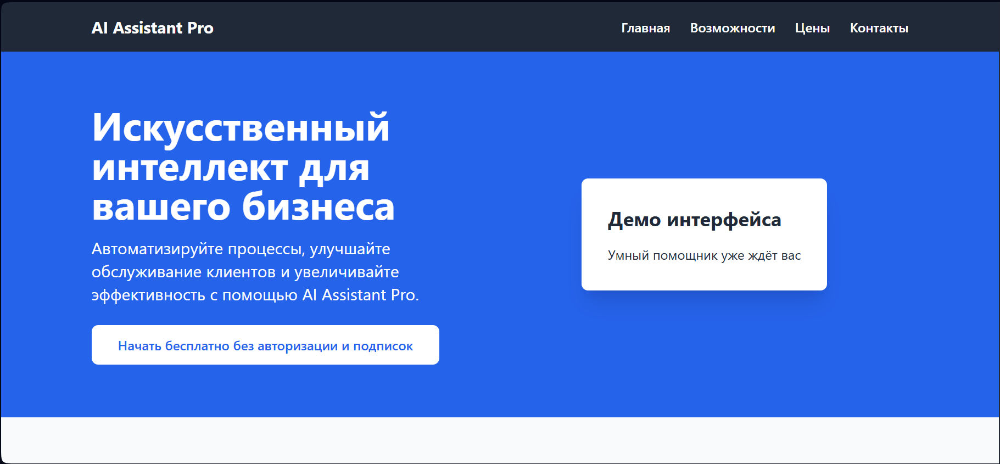
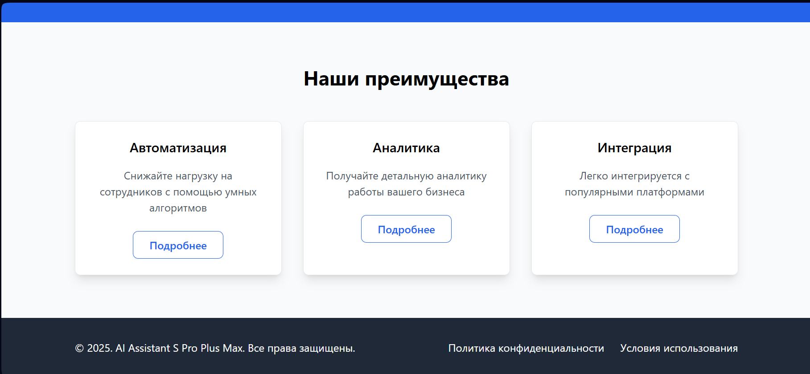

# Лабораторная работа №4: CSS-библиотеки

## Описание проекта
Сравнение компонентного подхода Bootstrap и utility-first подхода Tailwind CSS на примере лендинга для продукта "AI Assistant Pro".

## Структура проекта

```
lab4/
├── bootstrap-landing/
│   └── index.html
├── tailwind-landing/
│   └── index.html
└── README.md
```

## Ответы на вопросы

### 1. Какой подход (компонентный Bootstrap или utility-first Tailwind) показался вам удобнее для этой задачи и почему?

Bootstrap оказался удобнее для быстрого прототипирования, поскольку предоставляет готовые компоненты, которые можно сразу использовать. Для создания стандартного лендинга с навигацией, карточками и кнопками Bootstrap требует меньше времени.

Tailwind CSS даёт больше гибкости и контроля над дизайном, но требует больше времени на написание классов. Он лучше подходит для кастомных дизайнов, где важна уникальность.

### 2. Приведите пример кода для одного и того же элемента (например, кнопки) на Bootstrap и на Tailwind из вашей работы. В чем ключевое различие в разметке?

Bootstrap:
```html
<button class="btn btn-primary btn-lg mt-3">Начать бесплатно</button>

Tailwind CSS:
<button class="bg-blue-600 text-white px-8 py-3 rounded-lg font-semibold hover:bg-blue-700 transition duration-300">
    Начать бесплатно
</button>
```

Ключевое различие: В Bootstrap используются семантические классы (btn, btn-primary), которые описывают назначение элемента. В Tailwind используются утилитарные классы, которые описывают конкретные стилевые свойства.

### 3. С какими сложностями вы столкнулись при работе с каждой из библиотек?

**Bootstrap:**
- Сложность глубокой кастомизации компонентов
- Ограниченность готовых стилей
- Необходимость переопределять стили для нестандартных решений

**Tailwind CSS:**
- Большое количество классов в разметке
- Необходимость запоминать множество утилитарных классов
- Первоначальная настройка занимает больше времени

### 4. Какой блок вы добавили дополнительно?

Был добавлен блок **"Демо интерфейса"** в главной секции (hero section), который визуализирует интерфейс AI Assistant Pro и делает лендинг более наглядным.

### 5. Какие запросы вы использовали для помощи ИИ? Насколько полезными были ответы?

**Запросы к ИИ:**
1. "Сгенерируй адаптивный лендинг для AI Assistant Pro на Bootstrap 5 с навигацией, главным экраном, карточками преимуществ и футером"
2. "Создай аналогичный лендинг на Tailwind CSS с такими же секциями"
3. "Добавь адаптивность для мобильных устройств"

**Полезность ответов:** Ответы ИИ были очень полезны - они предоставили готовую базовую структуру, которую оставалось только адаптировать под конкретные требования. Это значительно ускорило процесс разработки.

## Скриншоты:


